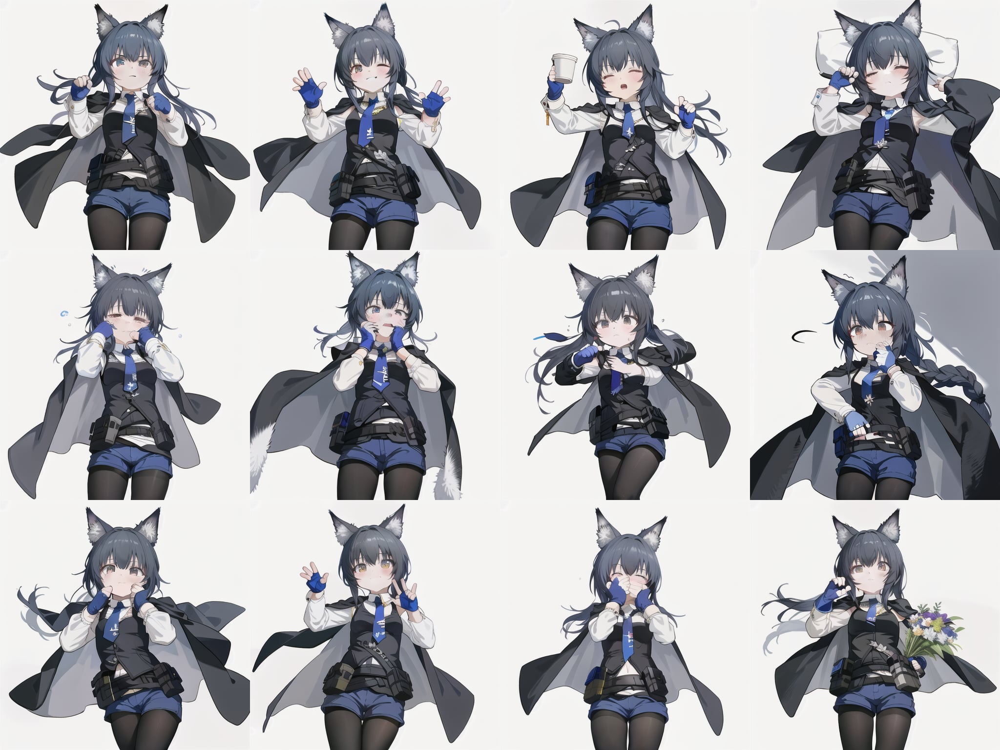

# SDiker

<div style="display: flex; gap: 10px;">


</div>

## 專案簡介
（由於穩定性的問題，這是一個進行到一半的實驗）</br></br>
本專案是一個基於 Stable Diffusion WebUI 之 API 的角色生成和表情包製作工具。它提供了一個直觀的圖形界面，讓使用者能夠輕鬆生成角色圖像和表情包。

## 開發動機
由於友人透過 Midjourney 搭配 LoRA 生成貼圖套組並申請 LINE 貼圖，但明顯的缺點在於單套的表情動作基本都被 LoRA 限制住，因此打算嘗試製作一個逐個給予提詞生成的工具。

## 主要功能
- 角色生成：目前支援四種風格的角色生成
  - Ｑ版風格
  - 動漫風格（兩種）
  - 半寫實風
  - 寫實風格
- 表情包生成：可基於生成的角色創建表情包
- 表情包導出：支援將生成的表情包導出使用
- 自定義設置：可調整生成參數和系統設置


## 測試環境
`Python 3.10.11` `Windows 11` `[GPU] RTX-3050Ti`

## 安裝步驟
1. 複製專案到本地：
```
git clone https://github.com/babaochou2420/SDiker.git
```

2. 創建並激活虛擬環境：
```bash
python -m venv .venv
.venv\Scripts\activate     # Windows
source .venv/bin/activate  # Linux/Mac
```

3. 安裝依賴：
```bash
pip install -r requirements.txt
```

### 建議模型
請將下列的核心要素丟到 SD WebUI 之中
- Stable Diffusion
  - [(2.22 GB) CuteYukiMix](https://civitai.com/models/28169/cuteyukimixadorable-style)
- LoRA

## 使用方法
### 啟動 SD WebUI
1. 開通 API</br>
在所使用的作業系統上，針對 webui-user 執行腳本在 `COMMANDLINE_ARGS` 加入 `--api`
2. 執行上述執行腳本等待程式開啟卽可

### 啟動 SDiker

1. 啟動應用：
```bash
gradio app.py
```

2. 在瀏覽器中訪問：
```
http://127.0.0.1:18477
```

3. 使用界面：
   - 選擇「生成角色」標籤頁來創建新角色
     - 建議使用 LoRA 保持角色穩定性
     - 可以上傳照片經過 Tagger 輔助該角色的題詞
   - 使用「生成表情包」標籤頁來創建表情包
   - 在「導出表情包」標籤頁中導出已創建的表情包
     - 針對社群分享提供表格彙整
       - 選擇表格行列數量
     - 針對創作需求提供單張輸出
   - 在「設置」標籤頁中調整系統參數

## 注意事項
- 生成高質量圖像可能需要較長時間
- 建議使用支持 CUDA 的顯卡以提升生成速度

## 限制
* 為求輕便本專案並沒有使用 ControlNet 的 OpenPose 與 來增強穩定性，因此不適合沒有 LoRA，且多少會有地方需要微調